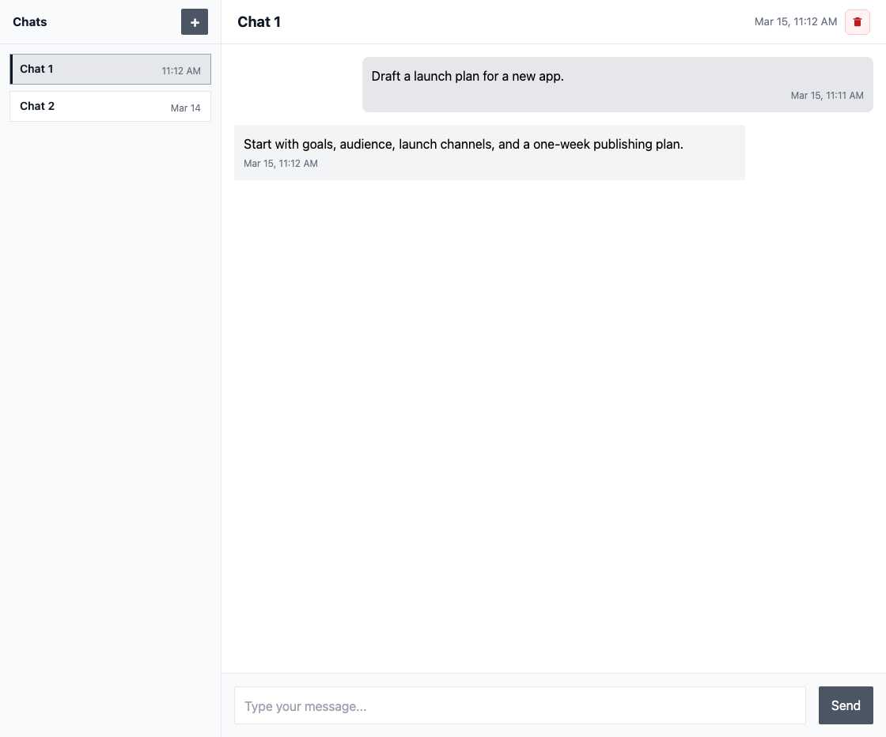

# Python-First LLM Chat Workbench

A lightweight FastAPI + HTMX project for quickly experimenting with LLM chat behavior in Python.

This repository is intentionally a workbench, not a full-featured production chat platform. It is designed to be usable out of the box while staying easy to fork and extend.

## Screenshot

Example desktop chat session:



## Vision And Planning

- Vision: `plans/VISION.md`
- Plans: `plans/PHASES.md`

This README focuses on project scope, current behavior, setup, and contributor workflow.

## Current Capability (Today)

- Server-rendered web chat UI with HTMX interactions.
- Multi-turn chat flow with persisted history per chat.
- Multiple saved chats per browser/client with sidebar or drawer navigation.
- Deterministic default chat titles plus confirmed delete behavior that returns users to the next visible chat or the start screen.
- `New chat` start screen plus chat restoration through route-backed URLs.
- In-flight request locking plus persisted request IDs so duplicate submissions are replayed instead of being processed twice.
- Lightweight loading feedback while switching chats.
- Inline failure handling for validation, service-unavailable, and transport-error states.
- OpenAI-backed default harness adapter plus a shipped Anthropic proof adapter, both resolved through the normalized event-capable `ChatHarness` surface, with `run_events()` canonical and `run()` acting as the non-streaming collector.
- Backend-configured harness selection for new chats through `DEFAULT_CHAT_HARNESS_KEY`, with OpenAI remaining the default baseline and Anthropic available as the shipped alternative proof path.
- Normalized tool-call and tool-result event vocabulary plus an optional harness-owned `execute_tool_call()` seam for future tool experiments, while the shipped app still persists only user and assistant transcript turns.
- Startup-wired harness registry plus stable per-chat harness binding (`harness_key` with optional version metadata).
- A small `services/chat_turns.py` control layer that owns normalized harness execution, failure finalization, replay coordination, and observability shaping before the route renders the HTMX response.
- Harness-owned context builders that assemble model-facing prompt and transcript context from the canonical persisted chat history.
- SQLite-backed chat storage with per-client chat ownership and transcript persistence across reloads and restarts.
- Prompt-template-driven system and user prompt construction.
- Neutral `AI Chat` defaults with no implicit domain context beyond the persisted transcript for the active chat.
- Safe HTML rendering with fenced code block formatting.
- Responsive frontend suitable for desktop and mobile.

## Project Scope

- Keep the default experience usable out of the box for local personal or small-team use.
- Keep the web UI server-rendered and HTMX-first by default.
- Keep boundaries explicit between UI concerns and runtime/harness concerns.
- Keep runtime/provider behavior configurable through settings and harness adapters.
- Keep experimentation straightforward for prompts, models, memory shaping, and tools.
- Keep the repository easy to fork and adapt for focused use cases.

## Vision Summary

- This project is a lightweight Python-first workbench, not just a single chat endpoint.
- Chat is the first surface, while runtime behavior stays replaceable behind explicit contracts.
- Sessions, runs, tools, and memory behavior should remain inspectable and experiment-friendly.
- The default path should stay simple and local-first, even as capabilities grow.
- Product direction and planning details live in `plans/VISION.md` and `plans/PHASES.md`.

## Send Reliability Policy

- Each chat send includes a persisted request ID so exact duplicate POSTs for the same browser/client replay the stored outcome instead of creating duplicate turns.
- Each chat session persists a stable harness binding, so later sends resolve through the same configured harness key for the life of that chat.
- If a target chat is already missing, foreign, deleted, or archived when `/send-message-htmx` starts, the route returns `404` and persists nothing for that request.
- Once a send is accepted, the user turn is durable even if the assistant reply fails later.
- If a chat is deleted or archived while a send is already in flight, delete/archive wins: the user turn remains, the assistant turn is not persisted, and the route returns `409`.

## Setup

### Scripted Install (Recommended)

The repository now includes helper scripts:

- `scripts/install.sh`: clone/pull, dependency sync, and interactive `.env` setup
- `scripts/update.sh`: fast-forward pull plus dependency sync (no `.env` prompts unless requested)
- `scripts/run.sh`: foreground run and background process management (`start/stop/status/logs`)
- `scripts/install_wrappers.sh`: installs namespaced global commands (`bca-install`, `bca-update`, `bca-run`)

The install script runs on macOS and Linux (including Raspberry Pi OS), checks for required tooling, ensures `Python 3.11+`, installs `uv` if needed, and then prompts for `*_API_KEY` variables discovered in `.env.example`.
It also installs `bca-*` wrapper commands into `~/.local/bin` by default.

#### New machine setup

```bash
# Requires SSH access to GitHub
git clone git@github.com:jamieosh/basic_chat_app.git ~/.local/share/basic_chat_app && \
~/.local/share/basic_chat_app/scripts/install.sh
```

After opening a new terminal, `bca-install`, `bca-update`, and `bca-run` work from anywhere (if `~/.local/bin` is on your `PATH`).
Works on macOS and Linux (including Raspberry Pi).

Your app config file is:
```bash
~/.local/share/basic_chat_app/.env
```

If install did not prompt for keys (or you want to re-enter them):
```bash
bca-update --refresh-env
```

To update an existing install from GitHub:
```bash
bca-update
```

#### Detailed scripted setup

1. Clone the repository (or pull latest if you already have it):
```bash
git clone <repository-url>
cd basic_chat_app
```

2. Run the guided installer:
```bash
./scripts/install.sh
```

3. Ensure `~/.local/bin` is on `PATH` (one-time):
```bash
export PATH="$HOME/.local/bin:$PATH"
```

4. Run in the foreground (dev):
```bash
bca-run foreground --reload
```

5. Update later with:
```bash
bca-update
```

6. Re-run API key prompts during an update when needed:
```bash
bca-update --refresh-env
```

7. Re-run full installer logic later if needed:
```bash
bca-install
```

The application will be available at `http://localhost:8000`.

Install location note:

- By default, the scripts operate on the current repository when run from it.
- If you run them from elsewhere, set `BASIC_CHAT_APP_HOME` (or pass `--install-dir`) to point at a managed checkout, for example:
```bash
export BASIC_CHAT_APP_HOME="$HOME/.local/share/basic_chat_app"
```
- If your shell does not include `~/.local/bin` on `PATH`, call wrappers by full path:
```bash
"$HOME/.local/bin/bca-update"
```

### Manual Setup (No Helper Script)

1. Use Python 3.11+ and sync dependencies with `uv`:
```bash
uv sync
```

2. Create your local environment file from the checked-in example:
```bash
cp .env.example .env
```

3. Configure the harness for new chats in `.env`. OpenAI remains the default:
```dotenv
DEFAULT_CHAT_HARNESS_KEY=openai
OPENAI_API_KEY=your_api_key_here
```

Or switch the default for new chats to Anthropic:
```dotenv
DEFAULT_CHAT_HARNESS_KEY=anthropic
ANTHROPIC_API_KEY=your_api_key_here
```

4. Optional: override the local SQLite path if you do not want the default `data/chat.db`:
```dotenv
CHAT_DATABASE_PATH=data/chat.db
```

5. Optional: customize the selected provider defaults:
```dotenv
OPENAI_MODEL=gpt-5-mini
ANTHROPIC_MODEL=claude-sonnet-4-20250514
```

6. Run the application:
```bash
uv run uvicorn main:app --reload --host 127.0.0.1 --port 8000
```

The app loads `.env` from the project root, so startup does not depend on your current working directory once the project is importable.
The default database directory is created automatically on startup when needed.

## Running And Background Operation

Foreground run (recommended while developing):
```bash
bca-run foreground --reload
```

Background run (works on macOS and Linux/Raspberry Pi):
```bash
bca-run start
bca-run status
bca-run logs
bca-run stop
```

Notes:

- Background logs are written to `${BASIC_CHAT_APP_HOME:-<repo>}/.runtime/chat-app.log`.
- PID tracking is written to `${BASIC_CHAT_APP_HOME:-<repo>}/.runtime/chat-app.pid`.
- `scripts/run.sh start` does not survive reboot by itself. For reboot-persistent runtime, wrap it with your OS service manager (`systemd` on Linux/Raspberry Pi, `launchd` on macOS).
- `bca-run config` prints resolved paths and runtime defaults.

Runtime env vars for `bca-run`:

- `BASIC_CHAT_APP_HOME` or `BCA_HOME`: install/home directory for repo + runtime files.
- `BCA_HOST`: default bind host (for example `0.0.0.0`).
- `BCA_PORT`: default bind port.
- `BCA_RELOAD`: default reload behavior (`1/true/yes/on` enables reload).
- `BCA_RUNTIME_DIR`: override runtime directory for PID/log files.

You can set these in your shell or in your app `.env` file.
For LAN access on a Raspberry Pi (`http://raspberrypi4.local:8000`), add:
```dotenv
BCA_HOST=0.0.0.0
BCA_PORT=8000
```

Then check resolved values with:
```bash
bca-run config
```

To refresh global wrappers manually:
```bash
./scripts/install_wrappers.sh
```

## Dependencies

- git
- curl (only needed if `uv` is not already installed)
- Python 3.11+
- uv
- FastAPI
- HTMX
- Anthropic Python Client
- OpenAI Python Client
- Jinja2
- python-dotenv

## External Frontend Runtime Assumptions

The default UI intentionally depends on two browser-loaded public CDN assets so the project can stay runnable without a frontend build step.

- Required external hosts:
  - `unpkg.com` for HTMX
  - `cdn.tailwindcss.com` for Tailwind's browser runtime
- Current reviewed asset URLs:
  - HTMX: `https://unpkg.com/htmx.org@1.9.5`
  - Tailwind browser runtime: `https://cdn.tailwindcss.com`
- Responsibility split:
  - HTMX powers the default request/response interaction model for the chat form.
  - Tailwind's browser runtime provides the utility classes used by the page shell and chat layout.
  - `/static/css/chat.css` and `/static/js/chat.js` remain the project-owned frontend assets.
- If those external assets are blocked:
  - without HTMX, the chat form does not perform the intended inline request/append flow
  - without Tailwind's browser runtime, the page still renders HTML but loses much of its layout and visual styling
- Tradeoff:
  - this keeps the default setup minimal and avoids a frontend toolchain
  - it also means the baseline UI relies on public CDN availability and network access from the browser
- Guidance for forks:
  - if you need self-hosted, restricted-network, or air-gapped deployments, plan to replace these CDN references with locally served or otherwise controlled assets
  - treat any change to these asset URLs as an intentional runtime decision, not a cosmetic refactor

Maintainer note:

- HTMX version changes should remain exact and explicitly reviewed.
- Tailwind CDN usage is a temporary convenience for the no-build-step baseline, not a long-term commitment to public-CDN runtime delivery.

## Current Security Posture

The default template is for local development and experimentation, not for exposed public deployment.

- no authentication is included
- no authentication, rate limiting, or CSRF protection is included
- wildcard CORS is part of the current no-auth baseline, with credentials disabled by default
- deployment hardening is intentionally deferred beyond the default local baseline

Forks that move beyond trusted local or internal use should plan explicit security and operational hardening.

## Project Structure

```
basic_chat_app/
├── agents/                 # Chat harness contracts and implementations
│   ├── anthropic_agent.py  # Anthropic-backed harness adapter behind the contract
│   ├── base_agent.py      # Legacy compatibility shim and harness re-exports
│   ├── chat_harness.py    # Core ChatHarness contract and normalized types
│   ├── context_builders.py # Harness-owned context assembly helpers
│   ├── harness_registry.py # Startup-time harness registry and binding resolution
│   └── openai_agent.py    # OpenAI-backed harness adapter behind the contract
├── persistence/           # SQLite bootstrap and chat repository code
├── services/              # Turn lifecycle, normalized execution, and observability control layer
├── static/                # Static assets
│   ├── css/              # CSS styles
│   └── js/               # JavaScript files
├── scripts/               # Setup/update helpers
│   ├── install.sh         # Clone/pull, sync deps, and guided .env setup
│   ├── update.sh          # Fast-forward pull + dependency refresh
│   ├── run.sh             # Foreground run + background start/stop/status/logs
│   └── install_wrappers.sh # Installs bca-* global wrapper commands
├── templates/            # HTML templates
│   ├── components/       # Reusable components
│   └── prompts/         # AI prompt templates
├── utils/               # Utility functions
│   ├── diagnostics.py
│   ├── html_formatter.py
│   ├── logging_config.py
│   ├── prompt_manager.py
│   └── settings.py
├── main.py             # FastAPI application
├── pyproject.toml      # Project metadata and dependencies
└── uv.lock             # Locked dependency versions for uv
```

## Development

Dependency source of truth:
- `pyproject.toml` + `uv.lock`

Run tests with:
```bash
uv run python -m pytest
```

Install Playwright Chromium (required for `tests/e2e/test_chat_smoke.py`):
```bash
uv run playwright install chromium
```

Test suite layout:

- `tests/test_chat_repository.py`: repository persistence, visibility, and turn-request lifecycle coverage.
- `tests/test_chat_turn_service.py`: idempotency and conflict behavior through the service boundary.
- `tests/test_main_routes.py`: route-level request, replay, lifecycle, and error rendering behavior.
- `tests/test_anthropic_agent.py`: Anthropic harness request construction, normalization, and input validation.
- `tests/e2e/test_chat_smoke.py`: Playwright coverage for the browser shell, send flow, restore behavior, and visual baselines.

Run the frontend smoke test only:
```bash
uv run python -m pytest tests/e2e -q
```

Run the visual regression slice only:
```bash
uv run python -m pytest tests/e2e/test_chat_smoke.py -q -k "visual_"
```

Refresh the committed visual baselines after an intentional UI change:
```bash
UPDATE_VISUAL_BASELINES=1 uv run python -m pytest tests/e2e/test_chat_smoke.py -q -k "visual_"
```

Only update `tests/e2e/snapshots/` when a deliberate UI change is accepted. Snapshot churn should not be used to paper over unintended markup or styling regressions.

Run lint and type checks:
```bash
uv run ruff check .
uv run mypy .
```

Install git hooks:
```bash
uv run pre-commit install --hook-type pre-commit --hook-type pre-push
```

### Adding Or Replacing A Harness

Use this path when you want to add a provider-backed harness or a fake harness for tests:

1. Add a new implementation in `agents/` that exposes `ChatHarness`. Prefer a native `run_events()` implementation and leave `run()` as the shared collector; use `BaseAgent` only as a compatibility shim for older `process_message()` code.
2. Keep provider SDK calls, prompt assembly, context shaping, and provider-specific failure mapping inside that harness module. If the harness needs prompts, add them under `templates/prompts/<harness_key>/` and assemble them through a harness-owned context builder.
3. Register the harness in `agents/harness_registry.py` with a stable `identity.key` and optional `identity.version`. Use `DEFAULT_CHAT_HARNESS_KEY` to choose the default for new chats; existing chats keep their persisted binding.
4. Leave `main.py` focused on HTTP validation and HTMX rendering. The application layer should keep owning routing, persistence, idempotent turn lifecycle, and HTML rendering. The small control/service layer in `services/chat_turns.py` should keep owning chat-bound harness resolution, normalized execution, and failure presentation.
5. Add or update coverage in `tests/test_chat_harness_contract.py`, `tests/test_harness_registry.py`, `tests/test_chat_turn_service.py`, and `tests/test_main_routes.py` so alternate harnesses are proven without route-level or OpenAI-specific coupling.

The shipped OpenAI adapter in `agents/openai_agent.py` remains the default baseline for this repository. The shipped Anthropic adapter in `agents/anthropic_agent.py` is proof that the harness boundary supports a materially different provider shape without route-level branching.

### Other Extension Seams

1. **Tool Experiments**: Keep tool capability flags, `tool_call`/`tool_result` events, and any harness-owned `execute_tool_call()` behavior behind the harness contract. The current app flow is intentionally in-memory-only for tool activity and should continue to persist only user and assistant transcript turns until a future update changes that model.
2. **Custom Prompts And Memory Assembly**: Add or adapt templates in `templates/prompts/<agent_type>/`, then assemble them behind a harness-owned context builder instead of teaching routes how to shape provider-facing history.
3. **UI Components**: Add new components in `templates/components/`.

### Configuration

- Logging configuration can be modified in `utils/logging_config.py`
- Prompt templates can be customized in `templates/prompts/`
- UI styling can be adjusted in `static/css/chat.css`
- Runtime configuration is environment-driven through `.env` or process env vars.
- Harness selection defaults are environment-driven through `DEFAULT_CHAT_HARNESS_KEY`, while persisted chats keep their existing binding after creation. Changing the default affects only newly created chats.

Supported runtime environment variables:

- `DEFAULT_CHAT_HARNESS_KEY`: selects the backend harness for newly created chats. Supported shipped values: `openai`, `anthropic`. Default: `openai`.
- `OPENAI_API_KEY`: required when `DEFAULT_CHAT_HARNESS_KEY=openai`.
- `OPENAI_MODEL`: optional model name. Default: `gpt-5-mini`.
- `OPENAI_PROMPT_NAME`: optional prompt template suffix. Default: `default`.
- `OPENAI_TEMPERATURE`: optional model temperature from `0.0` to `2.0`. Default: `1.0`.
- `OPENAI_TIMEOUT_SECONDS`: optional OpenAI request timeout. Default: `30`.
- `ANTHROPIC_API_KEY`: required when `DEFAULT_CHAT_HARNESS_KEY=anthropic`.
- `ANTHROPIC_MODEL`: optional Anthropic model name. Default: `claude-sonnet-4-20250514`.
- `ANTHROPIC_PROMPT_NAME`: optional prompt template suffix. Default: `default`.
- `ANTHROPIC_TEMPERATURE`: optional Anthropic temperature from `0.0` to `1.0`. Default: `1.0`.
- `ANTHROPIC_TIMEOUT_SECONDS`: optional Anthropic request timeout. Default: `30`.
- `ANTHROPIC_MAX_TOKENS`: optional Anthropic max output tokens. Default: `1024`.
- `CHAT_DATABASE_PATH`: optional SQLite database path. Default: `data/chat.db`.
- `CORS_ALLOWED_ORIGINS`: comma-separated allowed origins. Default: `*`.
- `CORS_ALLOW_CREDENTIALS`: enables credentialed CORS requests. Default: `false`.
- `CORS_ALLOWED_METHODS`: comma-separated allowed HTTP methods. Default: `*`.
- `CORS_ALLOWED_HEADERS`: comma-separated allowed headers. Default: `*`.
- `LOG_LEVEL`, `COMPONENT_LOG_LEVELS`, `LOG_TO_FILE`, `LOG_DIR`, `APP_NAME`: optional logging controls.

For the default no-auth baseline, keep `CORS_ALLOW_CREDENTIALS=false`. If you enable credentials, use explicit `CORS_ALLOWED_ORIGINS` values instead of `*`.

### Safe Customization Points

- Prompts: edit `templates/prompts/openai/` or `templates/prompts/anthropic/` to change a shipped harness behavior, or add a new prompt directory for a new harness.
- Model and runtime settings: use environment variables first, then `utils/settings.py` if you need to change the supported configuration surface.
- Harness wiring: edit `agents/openai_agent.py` or `agents/anthropic_agent.py` only for the shipped adapters, or add a new implementation in `agents/` plus a registry entry in `agents/harness_registry.py` without changing the route layer.
- Chat UI behavior: edit `templates/components/chat.html`, `static/js/chat.js`, and `static/css/chat.css`.
- Visual baselines: update `tests/e2e/snapshots/` only when a deliberate UI change is accepted.

### Baseline Defaults

- The default assistant identity is `AI Chat`.
- The default chat request uses a fixed prompt name. With the default `gpt-5-mini` model, the effective request temperature remains the model default.
- The default system prompt is generic.
- The default user-context prompt remains available as a customization seam, but contributes nothing unless you explicitly add context variables or edit the template.
- The app keeps persisted multi-turn history only within the current browser/client's saved chats.
- The default request UX stays visually quiet on success: only the typing dots appear while a response is in flight, and the footer status area is reserved for validation or failure messaging.

### Best Practices

- Keep structure and APIs straightforward.
- Prefer small, localized changes over broad rewrites.
- Follow established error handling and logging patterns.
- Add or update tests with behavior changes.
- Preserve the current deterministic baseline coverage around startup/configuration, message formatting, and request failure paths.
- Keep docs aligned with `plans/VISION.md` and `plans/PHASES.md`.

## License

[MIT License](LICENSE)

## Contributing

1. Fork the repository
2. Create a feature branch
3. Commit your changes
4. Push to the branch
5. Create a Pull Request
